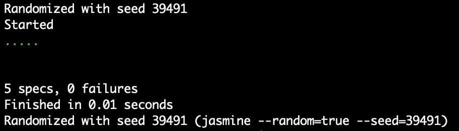

# Mars Rover - ThoughtWorks Code Assignment

Hello ThoughtWorker!

Below are detailed instructions to run my application, as well as a brief explanation of my design and assumptions made. 

## Getting Started

The instructions below will get my Mars Rover application set up in your dev environment.

## Prerequisites

- Ensure you have the latest version of node installed. 
- This application was built using [Node12.16.0](https://nodejs.org/download/release/v12.16.0/).

## Installing

First, clone the repository 

```
git clone https://github.com/mikegyi/marsrover.git
```

Install the dependencies

```
npm install
```

You should now have all the necessary packages required to run the tests.

## Running the tests

The JavaScript testing framework [Jasmine](https://github.com/jasmine/jasmine#installation) will have been installed in the previous section. 

To run the tests, simply use the following in your command line

```
jasmine
```

### Desired test result



## My design 

- To move forward, the rover simply adds 1 to the x or y coordinate, dependent on the current heading
- To turn, the rover uses the current heading to move through the compass points either clockwise (R) or anti-clockwise (L) 
- To execute multiple actions, the rover iterates over each action, applying each action sequentially
- To ensure the rovers move in order, a variable is assigned to each rovers position and the actions are applied one after another in the code

## My assumptions

- The rover can only face 4 different compass directions - North (N) East (E) South (S) and West (W)
- The rover won't be instructed by its users to fall off the 5 x 5 grid 
- The users won't instruct the rovers to crash into each other

## My process

- I built the project up with a strict focus on TDD using Jasmine
- Firstly, I wrote a test for the most simple action 'M' and then wrote the logic to make the test go green
- Once I had the most simple action working, I continued to build out the other actions 'L' and 'R', using the same process - writing the tests first
- I then wrote a test for a sequence of actions and used a for..of statement to iterate over the string, applying each action sequentially
- Next, I wrote the test for the given test data input
- Afterwards I used the split() method to convert the data into an array
- Then I had to convert the strings into an object in order for the given test input to work with the logic
- Finally, I had to convert the resulting object back to a string to make sure the test went green

## Built With

* [JavaScript](https://developer.mozilla.org/en-US/docs/Web/JavaScript) - The language used
* [Jasmine](https://jasmine.github.io/) - The testing framework used

<br>
Thanks for reading! :grinning: :space_invader: